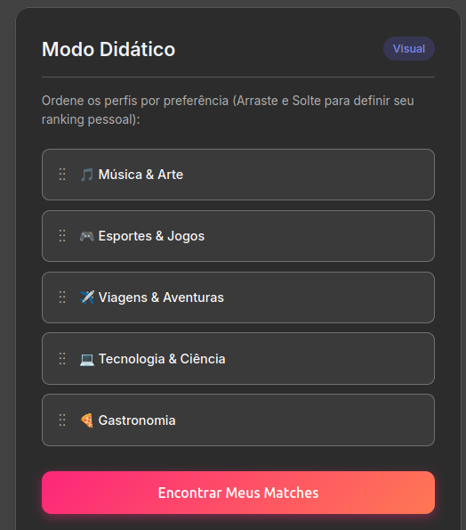
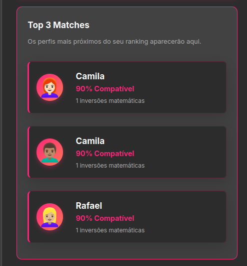
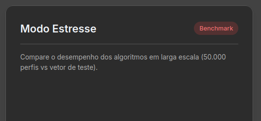
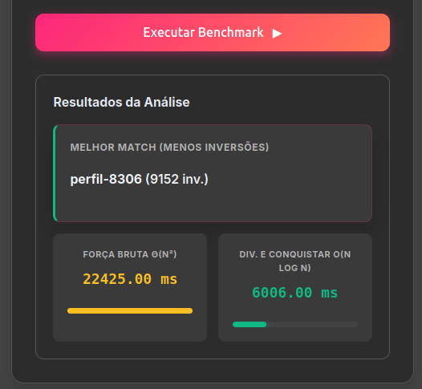

# Sistema de Recomendação de Afinidade (Dividir e Conquistar)

**Grupo:** G21_Dividir-e-Conquistar_PA-26.1  
**Conteúdo da Disciplina:** Dividir e Conquistar

## Alunos   
| Matrícula | Aluno |
| -- | -- |
| 21/1062320 | [Miguel Arthur](https://github.com/zlimaz) |
| 21/1062796 | [Mariiana Siqueira Neris](https://github.com/Maryyscreuza) |

## Sobre 

Este projeto é uma aplicação web interativa desenvolvida para demonstrar a eficiência do algoritmo de **Dividir e Conquistar** na resolução do problema de **Contagem de Inversões**. O sistema simula um mecanismo de recomendação de perfis (semelhante a aplicativos de relacionamento) baseado em afinidade de interesses.

### Como funciona o algoritmo?

O sistema mede a similaridade entre rankings de usuários. Um usuário ordena suas preferências e o algoritmo cruza essa ordenação com o banco de dados.
Para identificar a afinidade, o algoritmo calcula o número de inversões matemáticas entre os vetores de preferência:
1. **Força Bruta:** Utiliza complexidade Θ(n²), verificando elemento por elemento. Extremamente lento em larga escala.
2. **Dividir e Conquistar (Merge and Count):** Utiliza complexidade O(n log n). O vetor é dividido recursivamente pela metade e as inversões são contadas durante o processo de mesclagem (merge), tornando a busca por afinidade quase instantânea mesmo para dezenas de milhares de usuários.

## Screenshots do Sistema

### 1. Modo Didático e Matchmaker
*(Interface onde o usuário ordena os hobbies e encontra perfis compatíveis)*

  

### 2. Modo Estresse (Benchmark)
*(Prova matemática da superioridade do algoritmo O(n log n) sobre a Força Bruta processando 50.000 perfis)*

## Instalação 

O projeto foi construído puramente com tecnologias web nativas (HTML5, CSS3 Vanilla e JavaScript). Nenhuma biblioteca externa ou framework foi utilizado.
Portanto, não há necessidade de gerenciadores de pacote como npm ou yarn.

### Como executar

1. Clone o repositório para sua máquina local.
2. Navegue até a pasta do projeto.
3. Abra o arquivo `index.html` diretamente em qualquer navegador web moderno (Chrome, Firefox, Edge, Safari). Não é necessário subir um servidor local.

## Uso 

1. **Testando a Afinidade:** No "Modo Didático", arraste e solte os hobbies listados na ordem de sua preferência.
2. **Obtendo Recomendações:** Clique em "Encontrar Meus Matches" para que o algoritmo gere uma base de dados local, calcule as inversões usando O(n log n) e retorne os 3 perfis fictícios mais compatíveis com você.
3. **Executando o Benchmark:** No "Modo Estresse", clique em "Executar Benchmark". O sistema vai gerar 50.000 perfis com 500 preferências cada e submeterá essa carga aos dois algoritmos simultaneamente, plotando os resultados em milissegundos e graficamente na tela.

## Vídeo de apresentação

